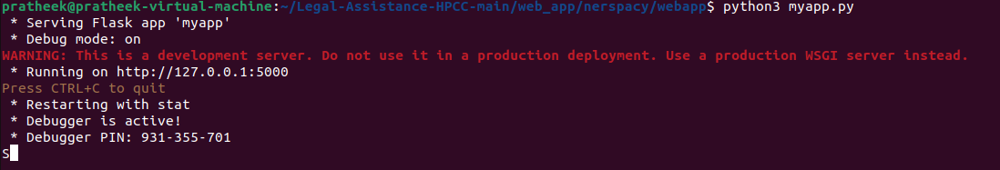
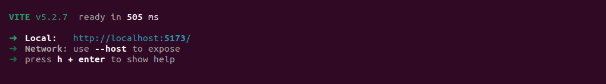
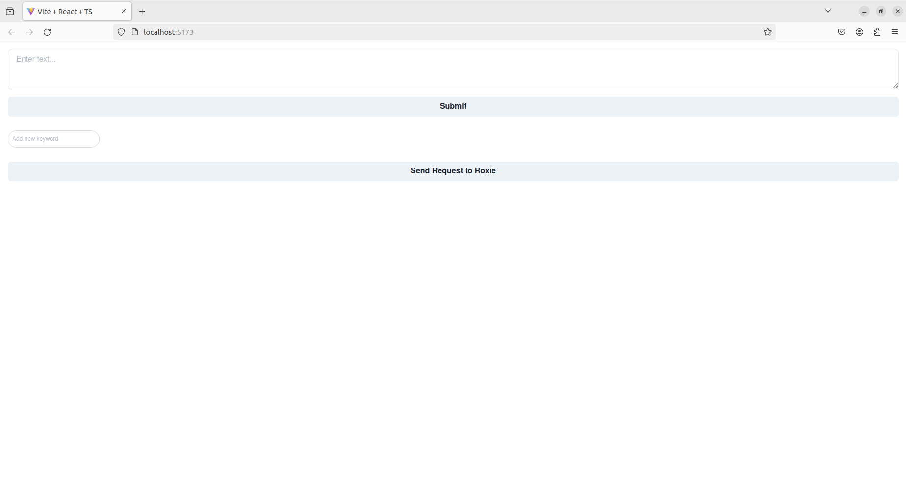
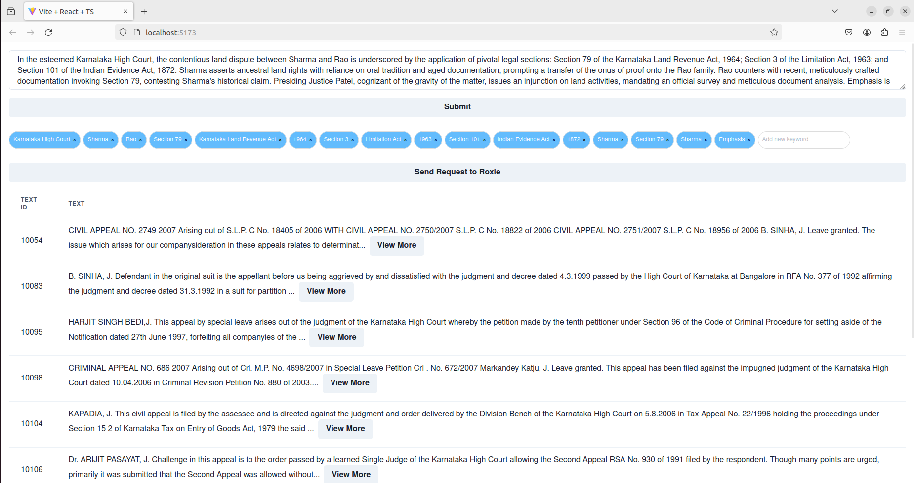

# Enhancing Legal Assistance through Data Enrichment with HPCC Systems
The legal system is based on precedents, with earlier court rulings serving as models for 
current cases. Finding analogous cases and spotting hidden relationships becomes essential
in this situation for deciphering legal nuances and gathering pertinent data. But as legal
professionals sift through the massive collection of cases, they frequently find intricate
patterns and relationships that aren't always obvious. Graph-based solutions are useful in the
legal field because they make it possible to depict complex relationships. The ideal choice
for this application is to use HPCC systems because they can manage the large-scale data
processing and storage needs of creating and querying a legal ontology on a legal data
corpus, allowing for effective retrieval of context-aware information.

## Requirements

1. **Python 3.10** :
 Ensure that pyhton 3.10 or greater is installed. You can download it from [python.org](https://www.python.org/downloads)
2. **Install Python Depenendicies**:
   Install the required Python dependencies using pip:
   
   ``` pip install -r requirements.txt ```
3. **Install Node.js**:
   Ensure you have Node.js installed on your machine. If not, download and install it from [nodejs.org](https://nodejs.org/en).

## Steps to Run Webapp

1. Clone this repo to your local system and change current directory.

   * ```git clone https://github.com/ManvithLB/Legal-Assistance-HPCC.git```
   * ```cd Legal-Assistance-HPCC/web_app/```
    
2. Run the Flask backend by navigating to ```cd Legal-Assistance-HPCC/web_app/nerspacy/webapp```. Once Navigated run the program by
   ```phyton3 myapp.py```. Upon successfuly execution terminal must look similar to the image below
   
    
   
3. Navigate to ```cd Legal-Assistance-HPCC/web_app/legal/legalhpcc```.
   
4. Install the node dependecies by ```npm install```.
   
5. Run the node app: ```npm run dev```
   
6. Open the localhost link 
    
7. The webapp has two enteries, one to enter the text in raw form, another entry to enter keywords directly.
    
  

8. Enter text and click on **Submit** to generate relevant keywords. Click on **Send Request to Roxie** to send keywords to Roxie and obtain the relevant output.

## Results


* Output obtained appears as above. 
* Keywords can be removed or added for more accurate searching.
* 10 most relevant cases are shown as output. 
* Each output is abridged, extended version can be obtained on clicking on view more.


